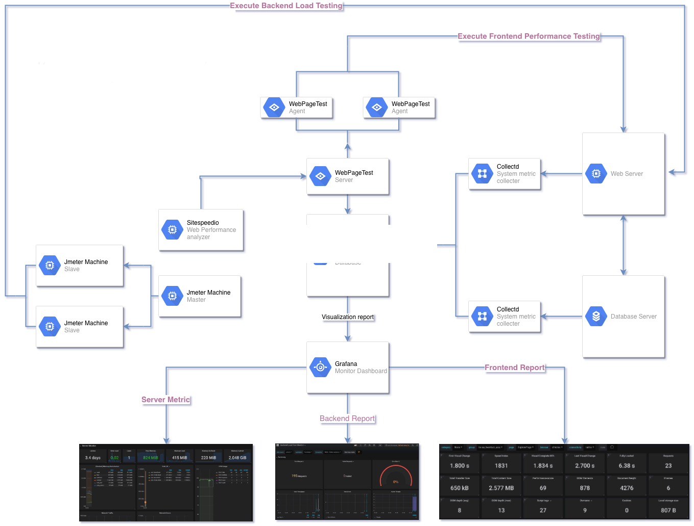

# Performance Test Framework Docker Base

Framework for Performance Testing with : 
* Jmeter : Backend load testing
* InfluxDB : time series DB platform for metrics 
* Grafana : data visualization 
* Collectd : service for collectiong metrics
* SpeedtestIO : Frond end load testing
* Webpagetest : private instance of webpagetest server 

---
## Structure

---

## Set up
1. Install collectd on app - db server 
- [x]     Copy files `install-colectd.sh` and `collectd.conf` from project to destination server. 
- [x] Edit collectd config in `collectd.conf` then execute file `install-collectd.sh`
2. Create a server for reporting and data visualization
3. Start docker containers for InfluxDB - Grafana - WebPageTest Server `docker-compose up -d` on reporting server
>     do not for got allow firewall for ports 8086, 25826, 3000  ( Or you could change the port in docker-compose.yml)
4. In Jmeter, add a backend listener to send metric to influxdb 
    `http://server_ip:8086/write?db=jmeter`

## Developing script
#### Backend load testing : 
- Using Jmeter Https Recorder | BlazeMetter Chrome exetension for generating scripts, then modify them
- Config number of VUs in thread then execute ( from GUI / Non GUI)
#### Frontend load testing : 
- Modify sitespeed/pre.js script for fit with app
- Modify url.txt,contains  all urls use for load testing
- Execute bash file `run-sitespeed.sh` with 3 parameters : url - args - config
    - url : Invidual url for load test, for e.g : https://google.com | Or url.txt file which contains list of urls
    - args : pre script if needed ( pre.js)
    - config : path to config file (config.json)
    - For e.g : `./run-sitespeed.sh ./url.txt pre.js twea-config.json`
## Reporting
- Access grafana dashboard then check the report
- If you don't like default report, https://grafana.com/dashboards there where you can search then download report which suite for you
